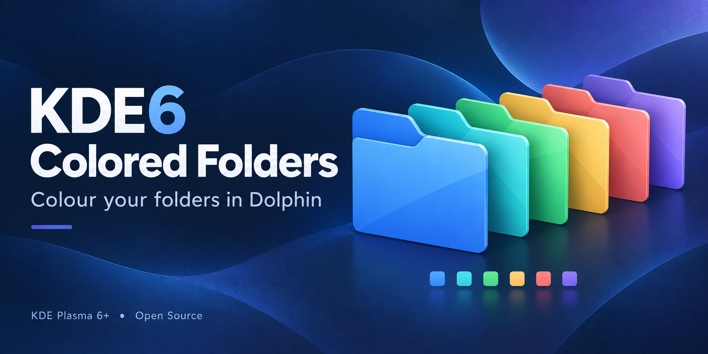
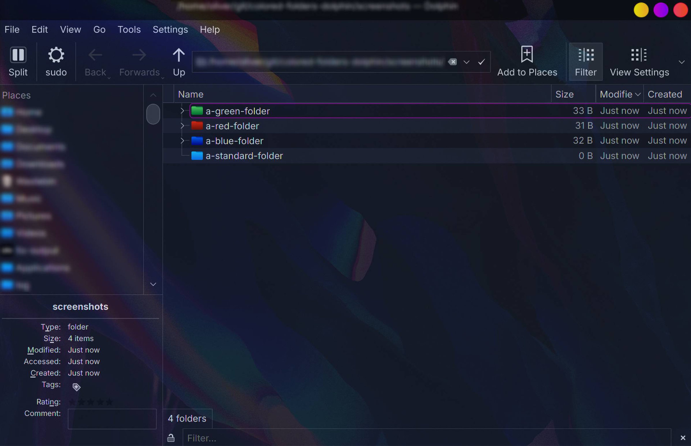
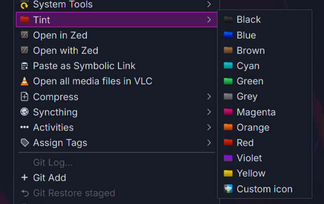

# Color Folder (Plasma 6 port)



A KDE Dolphin service menu for changing the colour of specific folders, but compatible with **KDE Plasma 6**.

This is an unofficial port of [dfaust/kde-color-folder](https://github.com/dfaust/kde-color-folder), which supports KDE4 and Plasma 5. All original functionality is preserved; only the parts that broke under Plasma 6 have been updated.

<!-- ==================================================================
     SCREENSHOT PLACEHOLDER
     Replace screenshot.png with a real capture (e.g. Dolphin's
     right-click context menu showing the "Tint" submenu) and delete
     this comment block. Keep the filename screenshot.png.
     ================================================================== -->



---

## Usage



1. Open Dolphin and navigate to the folder whose colour you want to change.
2. **Right-click the folder** and choose **Tint**.
3. Pick one of the eleven colours: Red, Orange, Yellow, Green, Blue, Violet, Magenta, Brown, Cyan, Grey or Black. The folder icon changes colour immediately, however you may need to refresh the folder for it to show.
4. To revert, right-click the folder again and choose **Tint → Remove color**. This restores the default folder icon.
5. **Tint → Remove .directory file** deletes the hidden `.directory` file entirely, wiping any other view settings stored in it.

Multiple folders can be coloured at once: select them all, right-click, and choose a colour.

> **Note:** if the colour does not refresh straight away, press `F5` in the Dolphin view. Dolphin does not always re-read a folder's `.directory` file immediately after it is edited externally — this is a known Dolphin behaviour, not a fault of this service menu.

---

## What changed for Plasma 6

| Area                              | Plasma 4/5                                | Plasma 6                                      |
| --------------------------------- | ----------------------------------------- | --------------------------------------------- |
| **Service menu path**             | `~/.local/share/kservices5/ServiceMenus/` | `~/.local/share/kio/servicemenus/`            |
| **System-wide path**              | `/usr/share/kservices5/ServiceMenus/`     | `/usr/share/kio/servicemenus/`                |
| **`.desktop` must be executable** | Not required                              | **Required** (security authorisation check)   |
| **Config tool**                   | `kf5-config`                              | `kf6-config`                                  |
| **Sycoca rebuild**                | `kbuildsycoca5`                           | `kbuildsycoca6`                               |
| **`ServiceTypes=` key**           | `KonqPopupMenu/Plugin`                    | Removed; use `MimeType=inode/directory;` only |

The install/uninstall scripts detect which version of Plasma is running (`kf6-config` for Plasma 6, `kf5-config` for Plasma 5, with a hard-coded fallback) and handle both automatically, so this port is backwards-compatible with Plasma 5 as well.

---

## Installation

### Official KDE Store

This service menu is published on the [KDE Store](https://store.kde.org/p/2371875) in the **Dolphin Service Menus** category, which also makes it installable directly from within Dolphin via **Configure Dolphin → Context Menu → Download New Services**.

### From source

```bash
chmod +x install.sh
./install.sh
```

That's it. Right-click any folder in Dolphin and look for the **Tint** submenu.

### Manual installation

```bash
# Create the directory (Plasma 6 path)
mkdir -p ~/.local/share/kio/servicemenus

# Copy files
cp colorfolder-breeze.desktop ~/.local/share/kio/servicemenus/colorfolder.desktop
cp colorfolder.sh              ~/.local/share/kio/servicemenus/colorfolder.sh

# Update the Exec path inside the .desktop file
SPATH=~/.local/share/kio/servicemenus
sed -i "s/colorfolder\.sh/${SPATH//\//\\/}\/colorfolder.sh/g" "$SPATH/colorfolder.desktop"

# Mark both files executable (mandatory for Plasma 6)
chmod +x ~/.local/share/kio/servicemenus/colorfolder.desktop
chmod +x ~/.local/share/kio/servicemenus/colorfolder.sh

# Rebuild service cache
kbuildsycoca6
```

---

## Uninstallation

```bash
chmod +x uninstall.sh
./uninstall.sh
```

---

## How it works

The service menu writes an `Icon=folder-<colour>` entry into the hidden `.directory` file inside each selected folder. Dolphin and KIO read this file to determine which icon to display. The colours available are: Red, Orange, Yellow, Green, Blue, Violet, Magenta, Brown, Cyan, Grey, Black.

The **Remove color** action comments out the `Icon=` line, restoring the default folder appearance. **Remove .directory file** deletes the `.directory` file entirely.

---

## Requirements

- KDE Plasma 6 / Dolphin 24.x (Plasma 5 is also supported by the install scripts)
- Breeze icon theme (or any icon theme that includes `folder-red`, `folder-green`, etc.)
- `bash`

---

## Licence and credits

- Original **Color Folder** for KDE4/Plasma 5 by Daniel Faust (hessijames@gmail.com), 2006–2018.
- Plasma 6 port maintained separately; backwards-compatible with Plasma 5.
- Licensed under the **GNU GPL-2.0** — see the [LICENSE](LICENSE) file.
